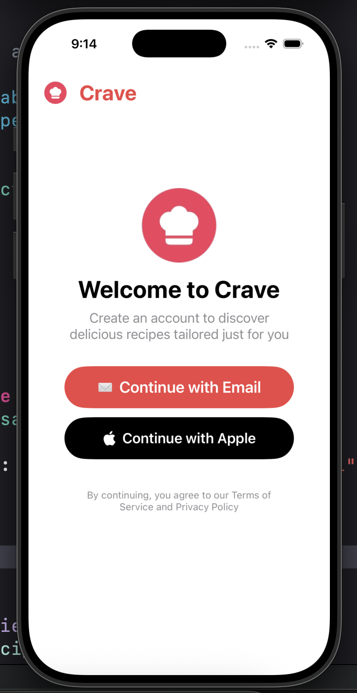
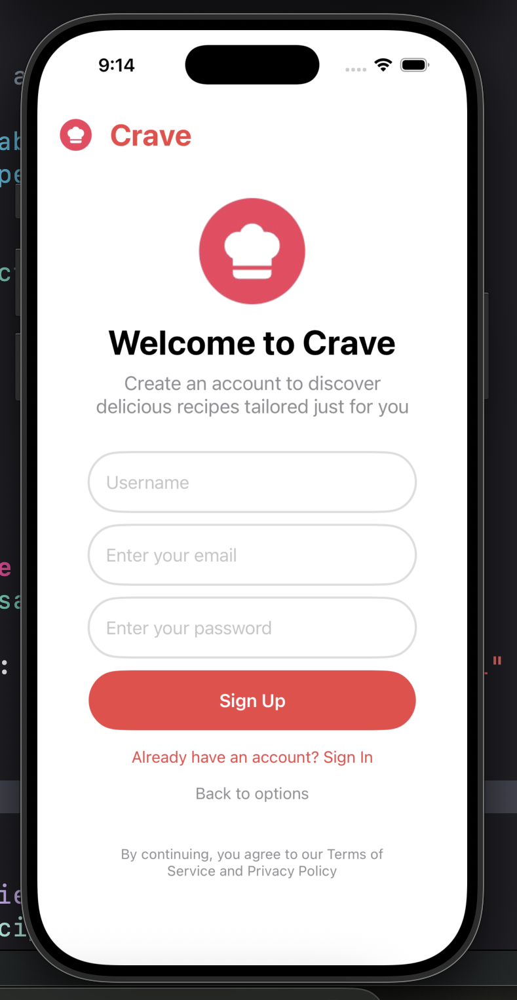
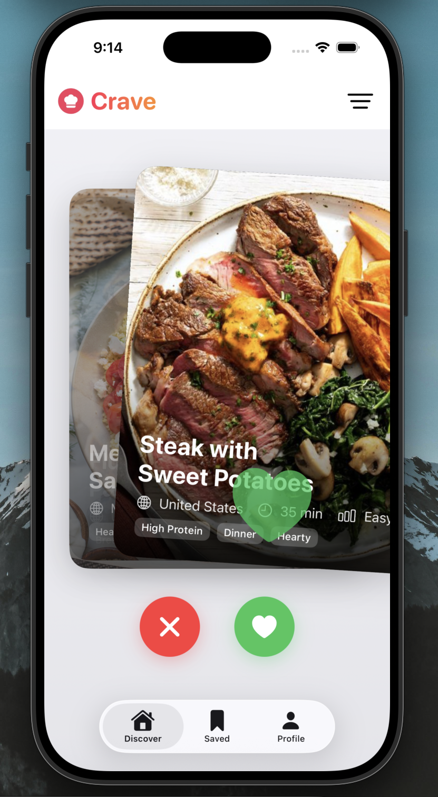
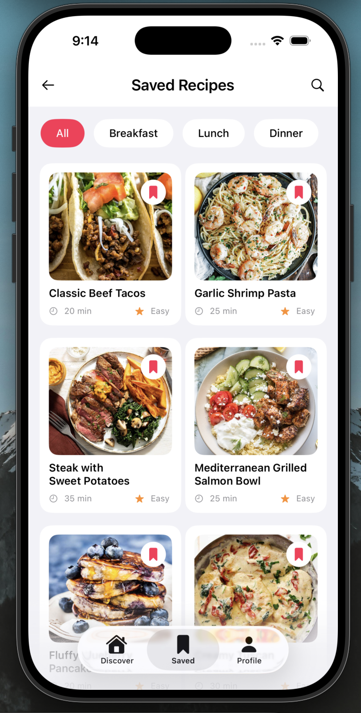
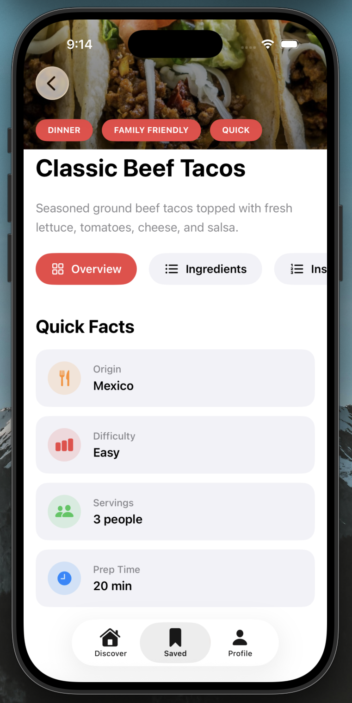
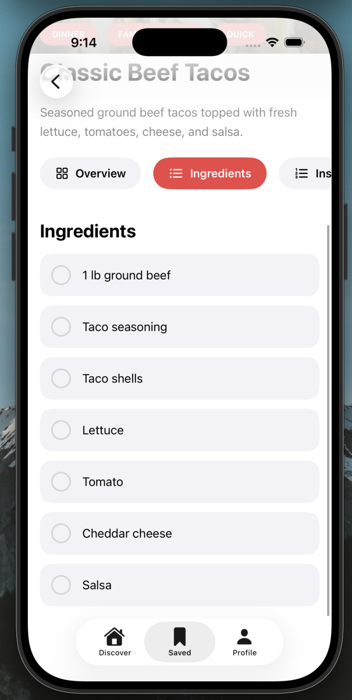
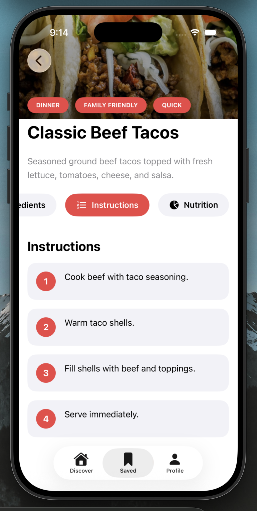
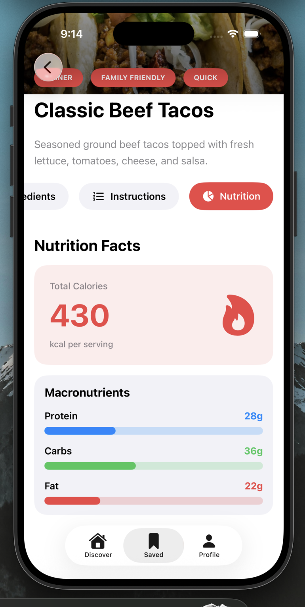
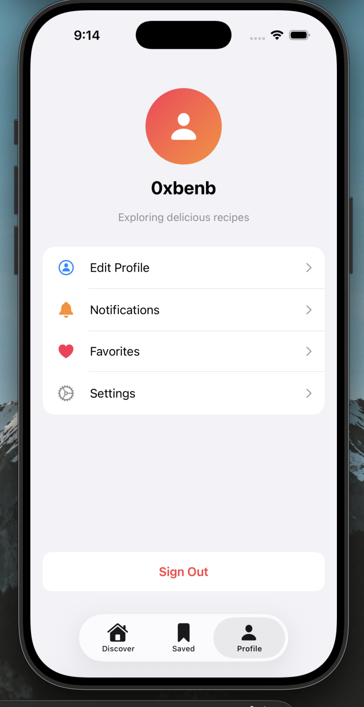

# 🍽️ Crave

**Crave** is a clean, modern iOS app for discovering, saving, and cooking recipes you’ll actually want to make. Swipe to discover new meals, save your favorites, and dive into step‑by‑step recipes in a fast and polished environment.

---

## ✨ Features

* 🔥 **Swipe to Discover** – Tinder‑style recipe discovery
* ❤️ **Save Favorites** – Keep recipes you love in one place
* 📋 **Detailed Recipes** – Overview, ingredients, instructions, and nutrition
* 🧮 **Nutrition Facts** – Calories & macros at a glance
* 👤 **User Profiles** – Simple account and profile management
* 🧭 **Tab‑based Navigation** – Discover · Saved · Profile
* 🚀 **Built to Scale** – A flexible foundation for powerful new features on the way
---

## 🧱 Built With

* **SwiftUI**
* **iOS Simulator / Xcode**
* **MVVM‑style architecture**

---

## 📱 Screens

* Welcome & Authentication
* Recipe Discovery Feed
* Saved Recipes Grid
* Recipe Detail (Overview · Ingredients · Nutrition)
* Profile & Settings

---

  
  
  

  
  
  

  
  
  

